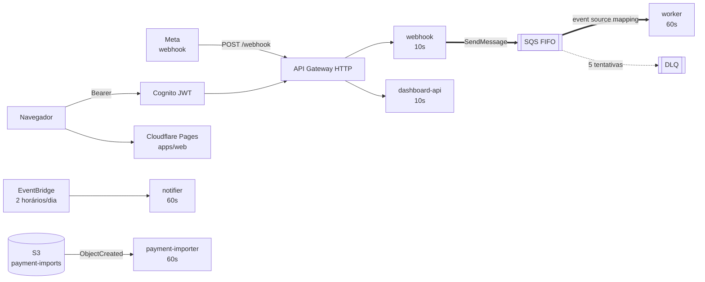
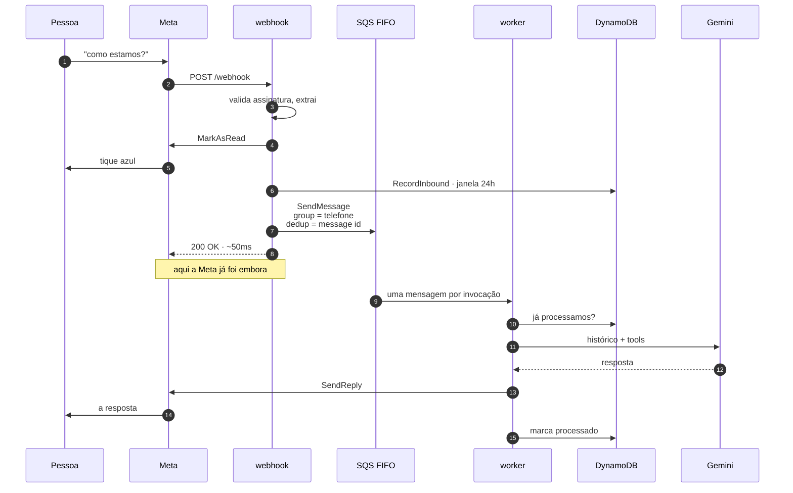

# Architecture

## Topologia

Cinco Lambdas. Nada aqui fica escutando, então o gatilho é a única coisa que
faz código rodar — e é o que importa saber de cada uma.

Quem toca o quê — em tabela e não em setas, porque cinco funções contra três
tabelas é um emaranhado desenhado e uma linha lida:

| Lambda | dispara com | lê/escreve | fala com |
| --- | --- | --- | --- |
| `webhook` | `POST /webhook` | `whatsapp-sessions` | Graph API (`MarkAsRead`) |
| `worker` | SQS FIFO | as três | Gemini, Graph API (resposta) |
| `dashboard-api` | API Gateway + JWT | `financial-entries` | — |
| `notifier` | EventBridge, 2×/dia | `financial-entries`, `whatsapp-sessions` | Graph API (digest) |
| `payment-importer` | S3 `ObjectCreated` | `financial-entries` | — |

O `webhook` e o `worker` são **duas metades do que era uma Lambda só**: a Meta
esperava o Gemini terminar, e uma pergunta que chama ferramenta leva dezenas de
segundos (ADR-028). O que os separa é a fila.

## O caminho de uma mensagem

**O tique azul sai no webhook, antes da fila**, e não no worker: com o turno
assíncrono a resposta pode levar dezenas de segundos, e o recibo de leitura é o
único sinal imediato de que a mensagem chegou. Ele diz "recebi", não
"respondi" — quem diz "respondi" é a resposta. Falhar ali não derruba a
mensagem.

A marca de processado é o contrário: escrita **depois** do turno, não reservada
antes, porque ela é o fato de alguém ter sido respondido (ADR-029). Na última
tentativa — o worker sabe pelo `ApproximateReceiveCount` — ele avisa a pessoa e
**ainda assim falha**, para a mensagem ir para a DLQ em vez de ser apagada
porque pedimos desculpa.

## Premissas

- custo abaixo de `R$20/mês`
- arquitetura serverless
- domínio isolado de AWS e de providers de IA
- **um ledger, duas pessoas**: a farmácia tem uma contabilidade só. Pai e filho
  entram com contas próprias no Cognito, e as duas leem e escrevem o mesmo
  ledger (`shared.FinanceLedgerID`). Isso não é um mock a caminho de
  multiusuário — é o produto. O que é por pessoa é só o endereço para onde as
  mensagens do WhatsApp vão (`domain.NotificationPrefs`, chaveado pelo `sub` real
  do Cognito).

## Decisões

- `apps/webhook` recebe o contrato externo, normaliza para `domain.Message` e
  **enfileira**. Ele não sabe o que é Gemini. Não há camada de comandos: toda
  mensagem vai para o agente (ver [whatsapp.md](./whatsapp.md)).
- `packages/waturn` é o turno em si — idempotência, agente, resposta. Está em
  `packages/` e não sob `apps/worker` porque dois binários o rodam: o worker
  atrás da fila e o webhook local, que não tem fila na frente e o chama inline
  para o `make demo` responder de ponta a ponta.
- `packages/orchestrator` controla o fluxo de ponta a ponta e é o único lugar
  que escolhe o provider de IA (`NewTextGenerator`).
- `packages/finance` expõe as tools que o agente chama; os argumentos chegam
  tipados, nunca como texto a ser interpretado.
- `packages/finance/analytics` é dono de todo número derivado — projeção, meta
  do dia, posição de caixa. Nenhum consumidor (dashboard, notifier, agente)
  recalcula: eles citam. Ver ADR-019 a ADR-022.

## Modelo de dados

Três tabelas DynamoDB, todas `PROVISIONED` para caber no free tier de 25/25
(ADR-005 explica por que não é tabela única).

### `financial-entries`

- `PK`: `USER#<ledger>` · `SK`: o tipo de item (entry, goal, categoria,
  destinatário de notificação, snapshot do dia)
- `GSI1` — índice por data de caixa (data de pagamento)
- `GSI2` — índice por data efetiva (`DueDate`, senão `TransactionDate`); é o que
  todo `ListEntries` usa
- sem TTL: é o livro-caixa

### `conversations`

- `PK`: telefone · `SK`: cronológico
- `TTL`: `ExpiresAt`
- uso: contexto recente da conversa para o agente

### `whatsapp-sessions`

- `PK`: `Phone` — e a marca de idempotência mora na mesma tabela sob uma chave
  prefixada, para os dois usos não colidirem no mesmo espaço de chaves
- `TTL`: `ExpiresAt` (20h)
- dois usos, de donos diferentes: a **janela de 24h** da Meta é do webhook (e do
  notifier, que só lê); a marca de **"já respondemos esta mensagem"** é do
  worker, escrita ao fim do turno por escrita condicional. A dedup do FIFO
  cuida do transporte e tem janela; esta é do domínio e não expira junto
  (ADR-029)

## Evolução sugerida

1. proteger o webhook com uma allowlist dos dois telefones — hoje qualquer
   número que escreva para a linha entra no ledger
2. ligar PITR e deletion protection na `financial-entries`
3. manter tools atrás de contracts explícitos
4. manter provider de IA trocável via `orchestrator.TextGenerator`
